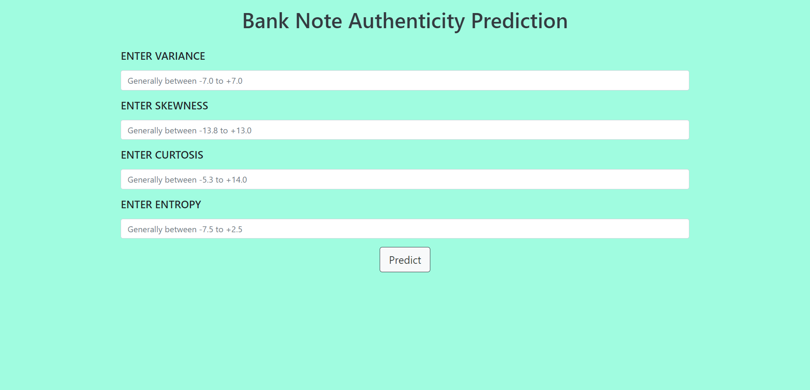
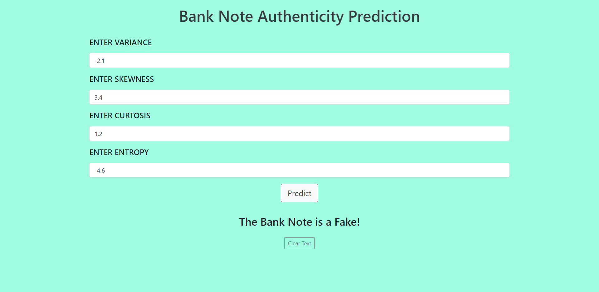

# Bank Note Authentication

Here is a web application to predict whether a bank note is authentic or fake.

## Dataset Used
* Bank Note Authentication Dataset from UCI Machine Learning Repository 
* [Link to dataset - UCI ML Repository](https://archive.ics.uci.edu/ml/datasets/banknote+authentication)
* [Link to dataset - Kaggle](https://www.kaggle.com/ritesaluja/bank-note-authentication-uci-data)

## Technologies Used
* Python 
* Flask
* Random Forest Classifier
* Pickle

## Screenshots

